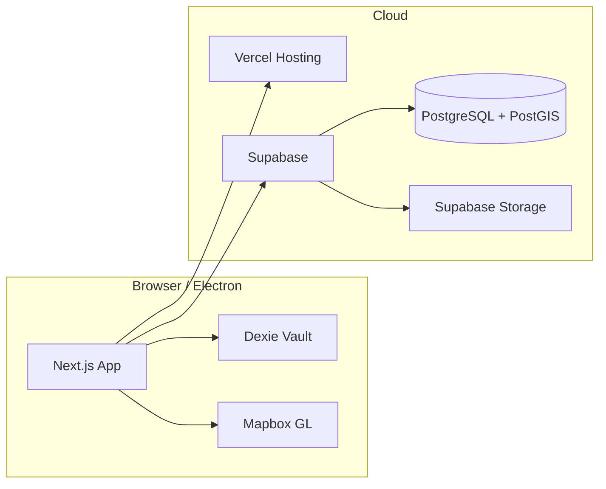

# 02 — Architecture

## System context



## Technology stack

| Layer | Choice | Role |
|-------|--------|------|
| UI framework | Next.js 14 App Router | SSR/SSG, routing, API routes (future) |
| Language | TypeScript | Type safety across app and content |
| Styling | Tailwind CSS + CSS variables | Tactical dark theme + `hud-sunlit` variant |
| Components | Radix primitives + local `components/ui` | Accessible dialogs, forms, tables |
| Map | Mapbox GL JS | Satellite, 3D terrain, future vector layers |
| Local persistence | Dexie (IndexedDB) | Vault logs + offline queue rows |
| Backend | Supabase | Auth, Postgres, Storage, RPC |
| Hosting | Vercel | Builds, previews, production |
| Desktop | Electron (`electron/main.cjs`) | Optional native shell; geolocation permission |

## Repository layout (high level)

```
src/app/                 # App Router: layouts, pages
src/components/hud/      # HUD shell, map view, layers, status rail
src/components/map/    # StrikeMap (Mapbox)
src/components/dashboard/# QuickLogFab (Digital Assay Book)
src/components/ui/       # Shared UI primitives
src/content/            # Static seed content (utilities, guides, expedition)
src/hooks/              # useGeoSync, useMap
src/lib/                # utils, supabase client, dexieStore
src/types/              # Domain types (HudMapLayerToggles, etc.)
supabase/migrations/    # SQL bedrock + optional expedition tables
electron/               # Electron main process
public/                 # sw.js (minimal service worker)
```

## Key design decisions

1. **Route group `(hud)`** wraps all primary screens with `HudShell` (header + bottom nav).
2. **Map is code-split** (`dynamic(..., { ssr: false })`) to keep first load smaller and avoid Mapbox on server.
3. **Hydration-safe online state** — `useGeoSync` initializes `online` as `true`, then reads `navigator.onLine` in `useEffect`.
